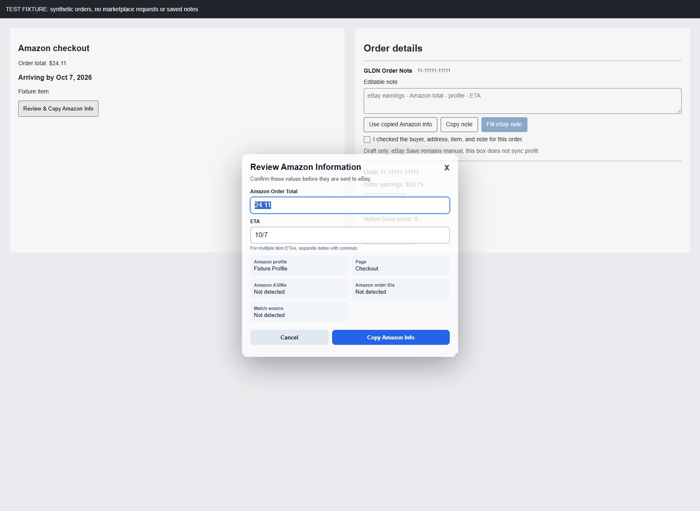
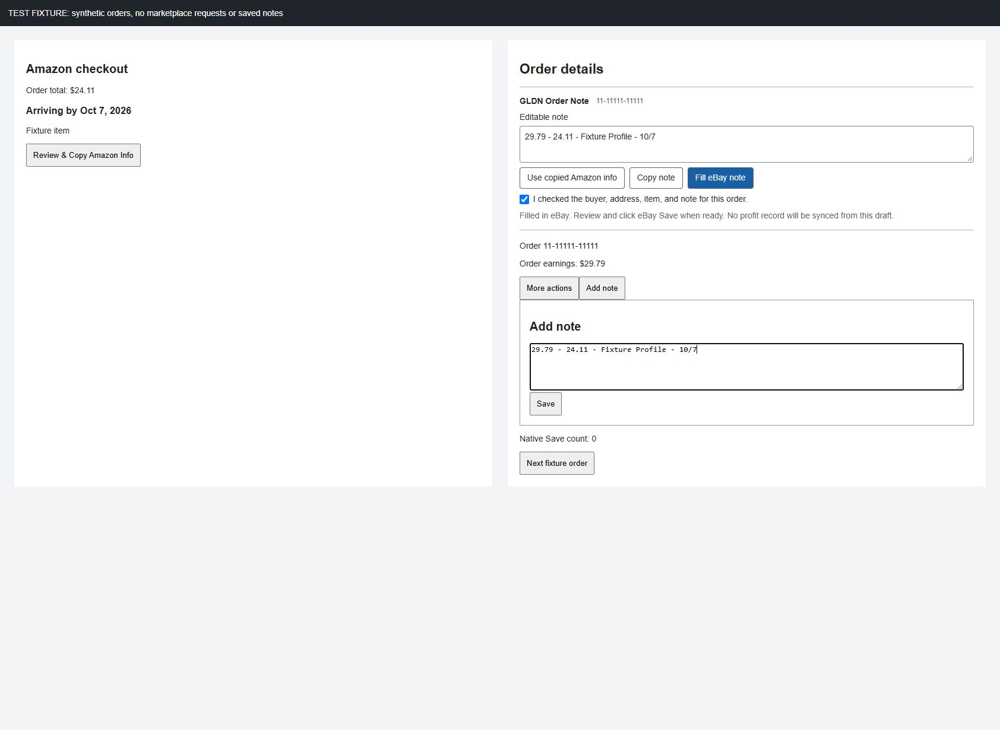

# ETA and eBay Note Verification

Version: 3.12.46
Date: 2026-10-03
Scope: synthetic local browser fixtures, not signed-in marketplace verification.

## Executable Checks

The focused ETA/note suite and existing Amazon-order, eBay-note, panel and profit contracts passed 31/31 tests before packaging.

The complete release check then passed all 617 automated tests, with zero failures or skipped tests, plus clean install, configuration preservation, reinstall with a running updater, rollback, invalid-checksum rejection, profile pairing and Chrome policy fixtures. Generated guides and package checks passed. Live dashboard testing was intentionally skipped because this release changes only Amazon ETA and eBay note UI.

Coverage includes selected "Arriving by Oct 7, 2026" -> 10/7, delayed delivery text, preserving manual date edits, rejecting stale or known mismatched imports, clearing order-specific state, clipboard denial, and no automatic Save or draft-profit sync.

## Browser Checks

The local fixture loads the actual changed Amazon/eBay functions with synthetic order IDs and an in-memory clipboard/storage adapter. No marketplace request is made.

1. Open Amazon review: ETA is 10/7 without typing.
2. Copy information and import it in the visible GLDN Order Note field.
3. Confirm the review checkbox is required before Fill eBay note.
4. Fill the simulated native note field: value is 29.79 - 24.11 - Fixture Profile - 10/7, native Save count is 0.
5. At 390x844, controls wrap and document width does not overflow the viewport.
6. Switch to the second fixture order: draft is empty, checkbox unchecked, Fill disabled, Save count still 0.
7. No browser error or warning logs were recorded. Temporary viewport override was reset and fixture tab/server closed.

## Live Boundary

The screenshot's signed-in Amazon checkout and eBay order were not present in the connected browser sessions. This evidence does not certify the actual account layout, purchase status, or installation on other computers. No real Amazon order was placed and no real eBay note was saved.
